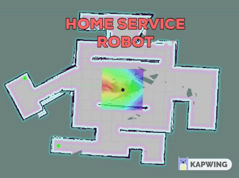

# HOME SERVICE ROBOT

Welcome to the Home Service Robot project! For this project, your goal is to program a home service robot that will autonomously map an environment and navigate to pickup and deliver objects.

Let’s summarize what should be done in this project to simulate a home service robot

1. Design a environment with the Building Editor in Gazebo.
2. Teleoperate your robot and manually test SLAM.
3. Create a wall_follower node that autonomously drives your robot to map your environment.
4. Use the ROS navigation stack and manually commands your robot using the 2D Nav Goal arrow in rviz to move to 2 different desired positions and orientations.
5. Write a pick_objects node that commands your robot to move to the desired pickup and drop off zones.
6. Write an add_markers node that subscribes to your robot odometry, keeps track of your robot pose, and publishes markers to rviz.

## Install Packages

$ mkdir -p ~/catkin_ws/src
$ cd ~/catkin_ws/src
$ catkin_init_workspace
$ cd ..
$ catkin_make
$ sudo apt-get update
$ cd ~/catkin_ws/src
$ git clone https://github.com/ros-perception/slam_gmapping
$ git clone https://github.com/turtlebot/turtlebot
$ git clone https://github.com/turtlebot/turtlebot_interactions
$ git clone https://github.com/turtlebot/turtlebot_simulator
$ cd ~/catkin_ws/
$ source devel/setup.bash
$ rosdep -i install gmapping
#All required rosdeps installed successfully
$ rosdep -i install turtlebot_teleop
#All required rosdeps installed successfully
$ rosdep -i install turtlebot_rviz_launchers
#All required rosdeps installed successfully
$ rosdep -i install turtlebot_gazebo
#All required rosdeps installed successfully
$ catkin_make
$ source devel/setup.bash

## Home Service

Needs to have run permissions.

$ chmod +x src/home_service.sh

Run home_service.sh to pick and drop markers to specified locations.

$ ~/catkin_ws/src/ShellScripts/home_service.sh
